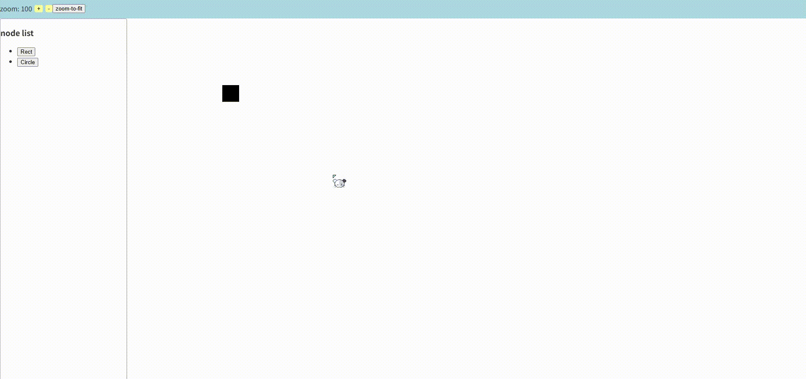
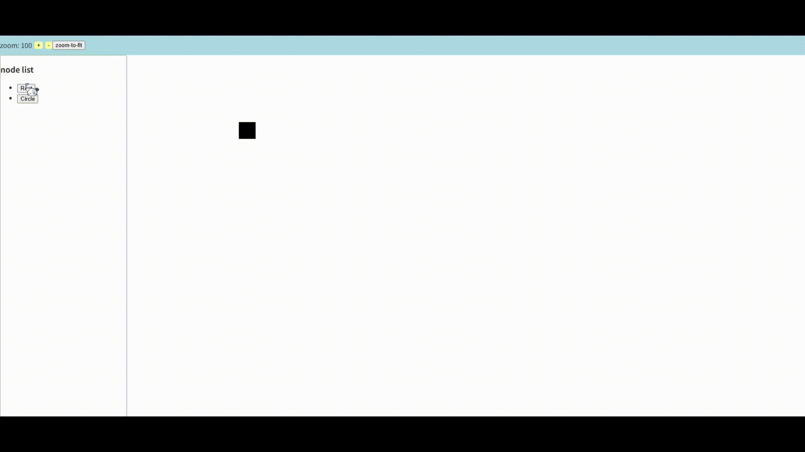

## 📌 Zoom 기능 소개

이 프로젝트는 HTML Canvas를 기반으로 줌(Zoom) 기능을 구현했습니다.
마우스 휠 또는 버튼 클릭을 이용해 확대/축소가 가능하며, 콘텐츠를 한 화면에 맞춰주는 Zoom to Fit 기능도 제공합니다.

### 🔍 Zoom In / Out

Zoom In : 콘텐츠를 일정 비율로 확대하여 세부 내용을 더 명확하게 확인할 수 있습니다.

Zoom Out : 콘텐츠를 축소하여 전체적인 레이아웃을 한눈에 파악할 수 있습니다.

확대/축소 시, 마우스 포인터 또는 지정한 좌표를 기준점으로 사용합니다.

스무스한 확대/축소를 위해 절대 스케일 값이 아닌 **이전 스케일 대비 비율(factor)** 로 계산합니다.

**예시 코드** <br />

```ts
zoomIn(x?: number, y?: number) {
  const canvas = document.getElementById("canvas-tools");
  const cx = x || (canvas?.clientWidth || 0 - panelWidth) / 2;
  const cy = y || (canvas?.clientHeight || 0) / 2;
  const pt = this.screenToWorld(this.ctx, cx, cy); // 기준점 좌표 변환
  const prevScale = this.scaleVal;

  this.scaleVal += 0.1;
  const scaleRatio = this.scaleVal / prevScale;

  this.viewportTransform = this.viewportTransform
    .translate(pt.x, pt.y)
    .scale(factor)
    .translate(-pt.x, -pt.y);
  }

  this.redraw();
```

### 🖼 Zoom to Fit

현재 화면에 존재하는 모든 콘텐츠를 캔버스 중앙에 맞추고, 크기를 자동으로 조절합니다.

콘텐츠의 Bounding Box를 계산하여, 가로/세로 비율에 맞게 스케일을 적용합니다.

중앙 정렬을 위해 콘텐츠의 중심 좌표를 구하고, 캔버스 중심과 맞추도록 translate 합니다.

**예시 코드** <br />

```ts
zoomToFit() {
  let minX = Infinity;
  let minY = Infinity;
  let maxX = -Infinity;
  let maxY = -Infinity;

  this.shapeList.forEach((shape) => {
    const tempMinX = shape.x;
    const tempMinY = shape.y;
    const tempMaxX = tempMinX + (shape.width || 0);
    const tempMaxY = tempMinY + (shape.height || 0);

    minX = Math.min(tempMinX, minX);
    minY = Math.min(tempMinY, minY);
    maxX = Math.max(tempMaxX, maxX);
    maxY = Math.max(tempMaxY, maxY);
  });

  const canvasWidth = (this.ctx?.canvas.width || 0) - panelWidth;
  const canvasHeight = this.ctx?.canvas.height || 0;
  const availableCanvasWidth = canvasWidth - padding * 2;
  const availableCanvasHeight = canvasHeight - padding * 2;

  const groupWidth = maxX - minX;
  const groupHeight = maxY - minY;
  const scaleX = availableCanvasWidth / groupWidth;
  const scaleY = availableCanvasHeight / groupHeight;
  const scale = Math.min(scaleX, scaleY);
  const offsetX = (canvasWidth - groupWidth * scale) / 2 - minX * scale;
  const offsetY = (canvasHeight - groupHeight * scale) / 2 - minY * scale;

  this.ctx?.setTransform(scale, 0, 0, scale, offsetX + 300, offsetY);

  this.viewportTransform = this.ctx?.getTransform() || new DOMMatrix();

  this.scaleVal = scale;
  this.clear();
  this._shapeList.forEach((shape) => {
    shape.redraw(this.ctx);
  });
}
```

### 🎯 기능 미리보기

(📸 여기에 Zoom In / Out GIF와 Zoom to Fit GIF 삽입)

#### Zoom in / out



#### Zoom to fit



### ⚙️ 구현 포인트

#### 좌표 변환(screen ↔ world)

확대/축소 및 이동 시 좌표계를 유지하기 위해 변환 함수를 구현했습니다.

#### 비율 기반 스케일링

누적 스케일 값에서 이전 스케일을 나눠 factor를 구함으로써 부드러운 줌을 구현했습니다.

#### Bounding Box 기반 중앙 정렬

Zoom to Fit 시 모든 콘텐츠의 경계 박스를 계산해 중앙에 맞췄습니다.
